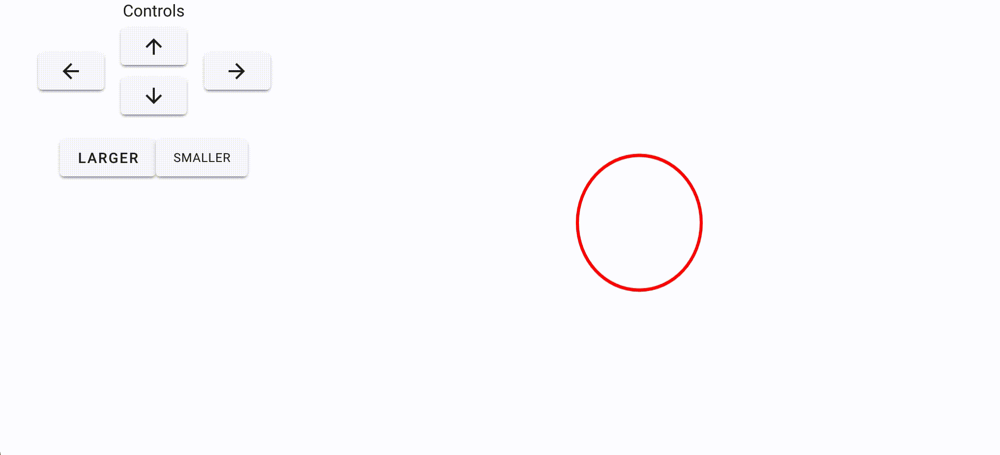

# vue-vuetify-paper
A working example combining:
- Vue: https://vuejs.org/
- Vuetify: https://vuetifyjs.com/
- paper.js: http://paperjs.org/

# Instructions

Simply clone the repo and browse to index.html.
```bash
git clone https://github.com/fbitti/vue-vuetify-paper.git
```

# Screenshot

